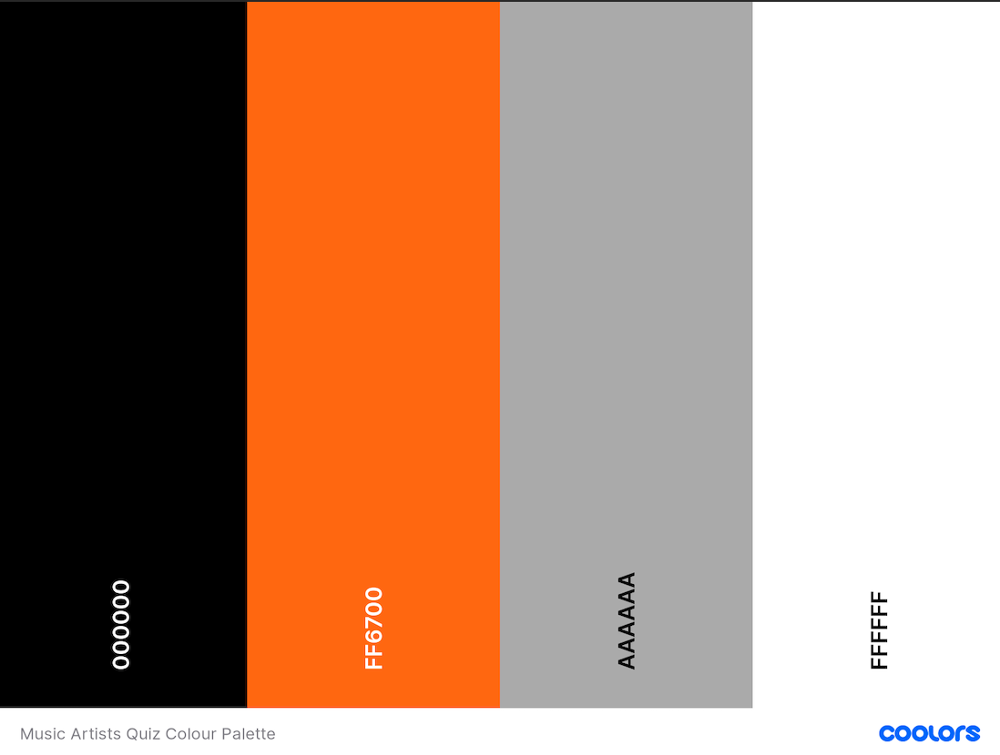

# [Music Artists Quiz](https://michaelekoh1.github.io/maq/index.html)

  

## Table of Contents

- [Project Goals](#project-goals)
- [Features](#features)
- [Feedback](#feedback)
- [Contributors](#contributors)
- [Build Process](#build-process)
- [Backers](#backers-)
- [Sponsors](#sponsors-)
- [Acknowledgments](#acknowledgments)

## Project Goals
Music Artists Quiz is a game or brain teaser to test ones knowledge.  It is free and for entertainment purpose.

User Goals: The user can test his/her knowledge of various music artists by playing the quiz.

*A screenshot of the Home page (index.html) is viewed on different screen sizes, generated by [ami.responsivedesign.is](http://ami.responsivedesign.is/). An interactive scrollable version is available [here](http://ami.responsivedesign.is/?url=https://michaelekoh1.github.io/maq/index.html).*

# UX
## User Stories

1. As a user, one would be able to know about various music artists.

## Design
### Initial Wireframes
Based on the above User Stories, the following wireframes were mocked up.

- [index.html](https://github.com/michaelekoh1/maq/blob/caf4bc5c2ecf754977300b9d41314aca41eced5a/wireframes/index.pdf#L1-L1)
- [quiz page](https://github.com/michaelekoh1/maq/blob/caf4bc5c2ecf754977300b9d41314aca41eced5a/wireframes/quiz.pdf)

### Colour Scheme

The site's colour scheme was built around the hero image.

### Features
In this section, we will see different parts of the site with a bit of description.

## Homepage Features

- The home page or the index page includes a photograph which covers the entire page with the login username option.
- The user has to fill in his/her name and click on the GO button to move on to the quiz page.

## Quiz Page

- Once the user has clicked on the GO button, they see an image of an artist with four names in front of it.
- The user has to select the correct answer by clicking on the right answer.
- On clicking the right or wrong answer the next artist image appears after showing the user if the previous answer was right or wrong.

## Result Page

- At the end the user sees their scores and see the top 5 scores on the right side of the page.

### Fonts

All fonts for the site are from [Google Fonts](https://fonts.google.com/).
- [Quicksand](https://fonts.google.com/specimen/Quicksand) is used for main headings and titles.
- [Open Sans](https://fonts.googleapis.com/css2?family=Open+Sans&display=swap) is used for sub-headings and for the body text.

## Technologies Used

- HTML5 - the pages of the website were designed using HTML.
- CSS3 -  the pages of the website were styled using CSS.
- [Gitpod](https://www.gitpod.io/) - the website was developed using Gitpod as the development environment.
- [Font Awesome](https://fontawesome.com/)- Font Awesome icons were used for the social media links on the contact page and in the services page.
- [Google Fonts](https://fonts.google.com/) Google Fonts were used throughout the project.
- [Favicon Generator](https://www.favicongenerator.com/)
- Favicon Generator was used to create and size the favicon for the site, using the logo created above.
- Photoshop(Adobe)- The logo was designed using Adobe Photoshop software.

# Testing

## Validator Testing

### HTML

- The HTML for the site's four pages was passed through the W3C Markup Validation Service, and no errors or warnings were found.

### CSS

- The site's CSS was passed through the W3C CSS Validation Service, and no errors were found.

